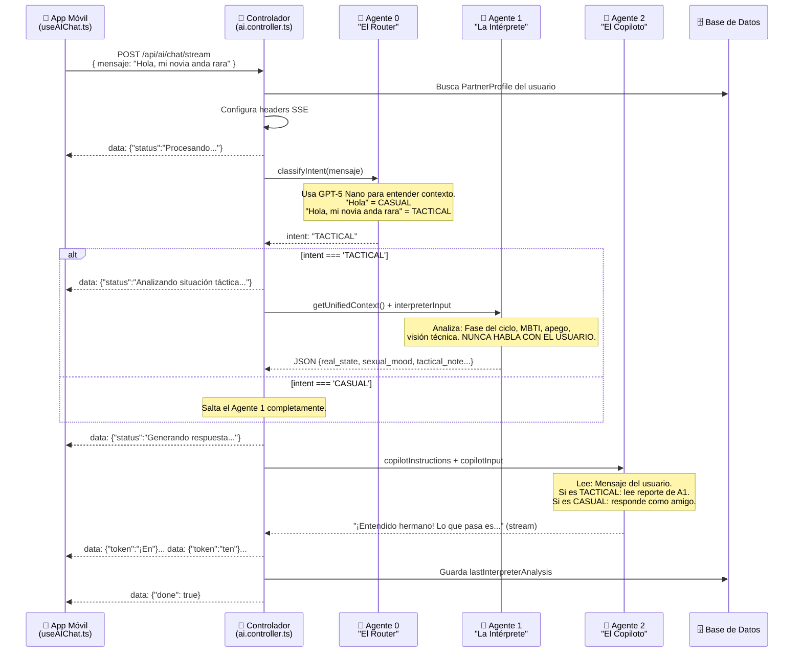

# MATECARE — MAPA TÉCNICO COMPLETO v5.3 (Sincronización Total)

> Este documento describe TODA la arquitectura, archivos, conexiones, funciones exportadas, flujos de datos y reglas del sistema MateCare.
> Úsalo como contexto maestro para que cualquier IA entienda el proyecto sin suponer nada.
> **Última actualización:** 2026-05-14 — Sincronización de Visión V2 + UI Reactiva

---

## 0. CAMBIOS RECIENTES CRÍTICOS (v5.3)
*   **Sincronización de Visión V2:** Corregido bug de mapeo de llaves entre Python (CamelCase) y TypeScript (SnakeCase). Ahora las 5 capas de visión (Energía, Atmósfera, Estilo, Postura, Emoción) fluyen sin pérdidas.
*   **Resiliencia del Motor:** Aumentado Timeout a 15s y ajustado Circuit Breaker (Threshold 10) para permitir el arranque pesado de modelos IA en Python.
*   **UI Reactiva:** Implementado `useFocusEffect` en el Perfil de Pareja para actualización automática de datos tácticos al navegar.
*   **HUD Táctico v2:** Desplegado sistema de etiquetas de doble capa en el móvil (Visión Técnica + Visión Estética).

---

## 0. CONTEXTO LÓGICO Y PROPÓSITO DEL PRODUCTO (¿Qué es MateCare?)

Para entender la arquitectura, primero hay que entender **para qué existe la app y a quién va dirigida**.

### El Problema
Las relaciones de pareja suelen ser complejas porque los hombres y las mujeres procesan la información y las emociones de forma distinta. Los hombres a menudo se sienten perdidos ante los cambios hormonales, emocionales o las señales visuales (lenguaje corporal, estilo) de su pareja.

### La Solución: MateCare
MateCare es una **aplicación táctica exclusiva para hombres**. Funciona como un **"HUD (Head-Up Display) de inteligencia relacional"** y un **Copiloto/Coach Masculino**. 
No es una app médica ni una "app rosa de calendario menstrual". Su diseño es oscuro, premium, gamificado y táctico (como una herramienta de inteligencia de grado militar para la vida civil).

### Pilares de Inteligencia (De dónde saca la información la IA):
1. **Biología:** Rastrea el ciclo menstrual de la mujer (Fase Folicular, Luteal, Ovulación, etc.) para anticipar fluctuaciones hormonales y de energía.
2. **Psicología:** Usa el tipo de personalidad (MBTI) y el Estilo de Apego de la mujer para saber cómo se comunica y qué necesita.
3. **Visión por Computadora (El Escáner):** Analiza fotos de la pareja usando una API de Python (DeepFace + YOLO) para extraer datos en tiempo real: nivel de estrés (tensión en la mandíbula), emociones ocultas, y estilo visual ("está vestida para salir", "está en pijama").

### El Rol de la IA (El Copiloto)
Con toda esa información, el sistema de IA (dividido en 3 agentes) se encarga de cruzar los datos y entregarle al usuario **"Misiones"** diarias y **Consejos Tácticos** altamente precisos. 
Si el usuario usa el chat, la IA le habla como un **"Coach/Hermano mayor experto"**, nunca como un robot, y NUNCA le habla a la mujer. Todo está diseñado para darle al hombre las herramientas para liderar y mejorar su relación.

---

## 1. STACK TECNOLÓGICO

| Capa | Tecnología | Puerto/URL |
|---|---|---|
| **Mobile** | React Native + Expo (SDK 53) | Metro :8081 |
| **Backend** | Node.js + Express + TypeScript | :3001 |
| **Base de datos** | PostgreSQL (Supabase hosted) | Supabase cloud |
| **Auth** | Supabase Auth (JWT Bearer tokens) | Supabase cloud |
| **ORM** | Prisma Client | — |
| **IA principal** | OpenAI GPT-5 Nano (`gpt-5-nano`) | api.openai.com |
| **Visión local** | Python 3.11 (DeepFace + YOLOv8) | :5001 |
| **Comunicación** | REST API (JSON), fetch con AbortController | HTTP |

### Reglas del modelo GPT-5 Nano:
- **NO soporta** `max_tokens` (error 400)
- `max_completion_tokens` causa `content: null` → **NO USAR**
- Los límites de respuesta se controlan **solo con el prompt** (límites de palabras)
- Soporta `response_format: { type: "json_object" }` ✅
- Soporta imágenes en el input (vision) ✅

---

## 2. ESTRUCTURA DE CARPETAS

```
matecare_ordenado/
├── 02_codigo_base/
│   ├── matecare-backend/
│   │   ├── prisma/
│   │   │   └── schema.prisma          ← Schema de la DB (ver sección 4)
│   │   ├── jobs/
│   │   │   └── dailyPhaseCheck.job.ts ← Cron 8AM (TODO: pendiente implementar)
│   │   ├── scripts/
│   │   │   ├── deepface_server_v2.py  ← ⭐ Servidor Python DeepFace+YOLOv8 (:5001)
│   │   │   ├── yolov8n.pt             ← Modelo YOLOv8 detección
│   │   │   └── yolov8n-pose.pt        ← Modelo YOLOv8 pose estimation
│   │   ├── test-ai.ts                 ← Script de prueba de IA (raíz, no en src)
│   │   └── src/
│   │       ├── index.ts               ← Entry point Express (:3001)
│   │       ├── verify-db.ts           ← Script de verificación de conexión DB
│   │       ├── scratch/               ← Carpeta de pruebas/temporales
│   │       ├── controllers/
│   │       │   ├── ai.controller.ts       ← POST /ai/chat y POST /ai/chat/stream
│   │       │   ├── vision.controller.ts   ← POST /ai/vision-chat
│   │       │   ├── dashboard.controller.ts← GET /dashboard/summary/:userId
│   │       │   ├── missions.controller.ts ← CRUD de misiones
│   │       │   ├── profile.controller.ts  ← CRUD de perfil
│   │       │   └── cycle.controller.ts    ← GET ciclo actual
│   │       ├── services/
│   │       │   ├── ai.service.ts          ← ⭐ MOTOR DOBLE AGENTE (core)
│   │       │   ├── cycleEngine.service.ts ← Cálculo de fases del ciclo
│   │       │   ├── visionAnalysis.service.ts ← Conexión a Python :5001
│   │       │   ├── personalityMapper.service.ts ← MBTI + Apego + Fases
│   │       │   ├── points.service.ts      ← Economía de puntos
│   │       │   └── notificationScheduler.service.ts ← Cron diario
│   │       ├── prompts/
│   │       │   ├── router.prompt.ts       ← Prompt Agente 0 (Router/Clasificador) ⭐ NUEVO
│   │       │   ├── interpreter.prompt.ts  ← Prompt Agente 1 (Intérprete)
│   │       │   └── copilot.prompt.ts      ← Prompt Agente 2 (Copiloto)
│   │       ├── routes/
│   │       │   ├── ai.routes.ts           ← /api/ai/*
│   │       │   ├── dashboard.routes.ts    ← /api/dashboard/*
│   │       │   ├── missions.routes.ts     ← /api/missions/*
│   │       │   ├── profile.routes.ts      ← /api/profile/*
│   │       │   └── cycle.routes.ts        ← /api/cycle/*
│   │       ├── middleware/
│   │       │   └── auth.middleware.ts      ← JWT Supabase validation
│   │       └── lib/
│   │           ├── prisma.ts              ← PrismaClient singleton
│   │           └── supabase.ts            ← Supabase admin client
│   │
│   └── matecare-mobile/
│       ├── .env                       ← EXPO_PUBLIC_API_URL, SUPABASE_*
│       ├── types/
│       │   └── modules.d.ts           ← Declaraciones de módulos TS
│       ├── app/
│       │   ├── _layout.tsx            ← Root layout + AuthGuard + OnboardingGuard
│       │   ├── (auth)/
│       │   │   ├── login.tsx          ← Pantalla de login
│       │   │   └── register.tsx       ← Pantalla de registro
│       │   ├── (onboarding)/
│       │   │   ├── _layout.tsx        ← Layout stack del onboarding
│       │   │   ├── cycle-setup.tsx    ← Configuración del ciclo
│       │   │   ├── personality-quiz.tsx ← Quiz MBTI
│       │   │   ├── theme-select.tsx   ← Selección de tema visual
│       │   │   └── confirm.tsx        ← Confirmación
│       │   └── (tabs)/
│       │       ├── _layout.tsx        ← Tab navigator (6 tabs)
│       │       ├── index.tsx          ← ⭐ DASHBOARD (consejo + misiones)
│       │       ├── chat.tsx           ← Chat con IA (usa SSE stream)
│       │       ├── vision-scan.tsx    ← Vision Control (subir foto)
│       │       ├── calendar.tsx       ← Calendario del ciclo
│       │       ├── profile.tsx        ← Perfil del usuario
│       │       ├── profile_cycle.tsx  ← Editar ciclo (tab oculto)
│       │       ├── profile_partner.tsx← Editar perfil pareja (tab oculto)
│       │       └── ranking.tsx        ← Ranking/leaderboard
│       ├── components/
│       │   ├── RecommendationCard.tsx ← Tarjeta del oráculo (solo texto)
│       │   ├── MissionCard.tsx        ← Tarjeta de misión (NORMAL/HOT)
│       │   ├── PhaseCard.tsx          ← Indicador de fase del ciclo
│       │   ├── CycleCompassHUD.tsx    ← Brújula visual del ciclo
│       │   ├── AnimatedLogo.tsx       ← Logo animado
│       │   ├── AnimatedSpriteLogo.tsx ← Sprite del logo
│       │   ├── CustomDatePicker.tsx   ← Date picker
│       │   ├── ErrorBoundary.tsx      ← Manejo de errores React
│       │   ├── FireShader.tsx         ← Shader de fuego (HOT)
│       │   ├── GoldShader.tsx         ← Shader dorado
│       │   └── NotificationManager.tsx← Push notifications
│       ├── context/
│       │   ├── AuthContext.tsx         ← Estado de autenticación Supabase
│       │   ├── ThemeContext.tsx        ← Tema visual (dark themes)
│       │   └── ToastContext.tsx        ← Notificaciones in-app
│       ├── hooks/
│       │   ├── useAIChat.ts           ← ⭐ Hook del chat con SSE streaming
│       │   ├── useCurrentPhase.ts     ← Fase actual (stub vacío)
│       │   └── usePartnerProfile.ts   ← Perfil pareja (stub vacío)
│       ├── services/
│       │   ├── api.ts                 ← ⭐ apiFetch() con timeouts por endpoint
│       │   ├── notifications.ts       ← Expo push notifications
│       │   └── storage.service.ts     ← AsyncStorage helpers
│       ├── constants/
│       │   ├── theme.ts               ← SPACING, RADIUS, TYPOGRAPHY
│       │   ├── themes.ts              ← 4 temas visuales (dark)
│       │   ├── config.ts              ← Config constantes
│       │   ├── personality.ts         ← Labels MBTI
│       │   └── phases.ts              ← Labels de fases del ciclo
│       └── lib/
│           └── supabase.ts            ← Supabase client (mobile)
```

---

## 3. API ENDPOINTS (Backend :3001)

Todas las rutas usan `requireAuth` (JWT Supabase) excepto `/health` y `/profile/leaderboard/all`.

### Prefijo: `/api`

| Método | Ruta | Controller | Función | Notas |
|---|---|---|---|---|
| GET | `/dashboard/summary/:userId` | dashboard.controller | `getDashboardSummary` | Retorna cache inmediato; genera en background |
| POST | `/ai/chat` | ai.controller | `handleChat` | Chat sin stream (usado por Vision Control) |
| POST | `/ai/chat/stream` | ai.controller | `handleChatStream` | ⭐ Chat SSE streaming — usa 3 agentes |
| POST | `/ai/vision-chat` | vision.controller | `handleVisionChat` | Análisis de foto + consejo táctico |
| GET | `/profile` | profile.controller | `getProfile` | |
| POST | `/profile` | profile.controller | `saveProfile` | |
| POST | `/profile/push-token` | profile.controller | `updatePushToken` | |
| GET | `/profile/current/:userId` | profile.controller | `getCycleStatus` | |
| GET | `/profile/leaderboard/all` | profile.controller | `getRanking` | SIN requireAuth |
| GET | `/missions/:userId` | missions.controller | `getSuggestedMissions` | También acepta GET `/missions/` |
| GET | `/missions/history/:userId` | missions.controller | `getMissionHistory` | |
| POST | `/missions/reset` | missions.controller | `resetMissions` | Fuerza regeneración IA |
| PATCH | `/missions/:id/progress` | missions.controller | `updateMissionProgress` | |
| POST | `/missions/:id/evidence` | missions.controller | `submitMissionEvidence` | |
| GET | `/cycle/current/:userId` | cycle.controller | `getCurrentCycle` | |

---

## 4. BASE DE DATOS (Prisma Schema)

### Modelos principales:

| Modelo | Campos clave | Relación |
|---|---|---|
| `User` | id, email, points, plan(FREE/PREMIUM) | 1→1 PartnerProfile, 1→1 PersonalityProfile, 1→N Mission, 1→N AIInteraction, 1→N EmotionalRecord |
| `PartnerProfile` | cycleLength, periodDuration, lastPeriodDate, personalityType, visionAnalysis(JSON), lastAdvice(Text), lastInterpreterAnalysis(JSON), lastVisionDescription(Text), adviceUpdatedAt | 1←1 User |
| `PersonalityProfile` | mbtiType(string), attachmentStyle(enum), preferences(JSON), mbtiConfidence(JSON) | 1←1 User |
| `Mission` | title, description, category, intensity("NORMAL"/"HOT"), progress(0-100), isCompleted, phaseContext(CyclePhase) | N←1 User |
| `AIInteraction` | userInput, aiResponse, phaseContext, promptTokens | N←1 User |
| `EmotionalRecord` | dominantEmotion, confidence, isAuthentic, isSuppressed, hasDiscrepancy, rawEmotions(JSON), phase, environment | N←1 User |

### Enums:
- `CyclePhase`: MENSTRUAL, FOLLICULAR, OVULATION, LUTEAL
- `PersonalityType`: INTROVERTED, EXTROVERTED, AMBIVERT
- `AttachmentStyle`: SECURE, ANXIOUS, AVOIDANT, DISORGANIZED
- `AffectionStyle`: PHYSICAL, VERBAL, ACTS, QUALITY
- `ConflictStyle`: AVOIDANT, DIRECT, PASSIVE
- `Plan`: FREE, PREMIUM

---

## 5. MOTOR DE IA — TRIPLE AGENTE v5.3 (ai.service.ts)

### Arquitectura: 3 agentes con clasificación inteligente de intención

```
┌────────────────────────────────────────────────────────────────┐
│  processChatStream(userId, msg, history, res)                   │
│                                                                  │
│  AGENTE 0 — "El Router" (SIEMPRE corre primero)                 │
│     Prompt: router.prompt.ts                                     │
│     Input: mensaje del usuario                                   │
│     Output: { "intent": "CASUAL" | "TACTICAL" }                  │
│                                                                  │
│     Si intent = CASUAL:                                          │
│       → Salta Agente 1 directamente al Agente 2                  │
│       → Copiloto responde como amigo (saludo, chat casual)       │
│                                                                  │
│     Si intent = TACTICAL:                                        │
│       → Corre Agente 1 completo                                  │
│       → Copiloto recibe inteligencia táctica de la novia         │
│                                                                  │
│  AGENTE 1 — "La Intérprete" (solo en modo TACTICAL)             │
│     Prompt: interpreter.prompt.ts                                │
│     Input: datos de LA NOVIA (ciclo, MBTI, apego, visión)        │
│            + pedido del novio                                    │
│     Output: JSON {real_state, sexual_mood, hidden_need,          │
│              risk_flag, tactical_note, style_analysis,           │
│              synergy_index}                                      │
│     NUNCA habla con el usuario. Escribe para El Copiloto.        │
│                                                                  │
│  AGENTE 2 — "El Copiloto" (SIEMPRE corre, al final)             │
│     Prompt: copilot.prompt.ts + inline rules por modo            │
│     Le habla al NOVIO. Info que recibe es SOBRE LA NOVIA.        │
│     Modo CASUAL: responde como amigo. Máx 25 palabras.           │
│     Modo TACTICAL: usa inteligencia de A1. Máx 35 palabras.      │
│     Output: texto plano (stream SSE token a token)               │
└────────────────────────────────────────────────────────────────┘

┌──────────────────────────────────────────────────┐
│  runUnifiedTacticalAI(context, msg, type, img?)  │  ← Dashboard y Vision
│  (2 agentes, sin Router — siempre es TACTICAL)   │
│                                                   │
│  1. AGENTE 1 — "La Intérprete"                   │
│     Datos de LA NOVIA → JSON técnico              │
│                                                   │
│  2. AGENTE 2 — "El Copiloto"                     │
│     Consejo al novio + JSON {response, missions}  │
│                                                   │
│  Return: {response, missions, interpreter,        │
│           styleAnalysis}                           │
└──────────────────────────────────────────────────┘
```

### Identidad de cada agente (CRÍTICO — no confundir):

| Agente | Nombre | Quién es | A quién le habla | De quién es la info que maneja |
|--------|--------|----------|-----------------|--------------------------------|
| **0** | El Router | Clasificador IA | — | Solo lee el mensaje del novio |
| **1** | La Intérprete | Psicóloga IA | Al Copiloto (nunca al usuario) | SOBRE LA NOVIA |
| **2** | El Copiloto | Coach masculino | AL NOVIO (el usuario) | Recibe info de La Intérprete SOBRE LA NOVIA |

### Funciones exportadas de ai.service.ts:

| Función | Firma | Uso |
|---|---|---|
| `getOracleAdvice` | `(userId, onlyCache?, forceRegenerate?) → string\|null` | Dashboard: genera consejo + 3 misiones. Cache 20h. |
| `processChat` | `(userId, msg, image?, history[]) → {response, vision, styleAnalysis, interpreter}` | Vision Control (no stream). |
| `processChatStream` | `(userId, msg, history[], res) → {response, interpreter}` | ⭐ Chat principal con SSE streaming. Usa 3 agentes. |
| `humanize` | `(val) → string` | Traduce claves de visión a español. |

### Reglas CRÍTICAS:
- **NO usar `max_tokens` ni `max_completion_tokens`** — causa content null en GPT-5 Nano
- Agente 0 y Agente 1 usan `response_format: { type: "json_object" }`
- Agente 2 en modo CHAT usa `stream: true` (texto plano, NO json_object)
- Los límites se controlan con el prompt:
  - Dashboard `response`: máx 40 palabras, SIN saludos
  - Chat CASUAL `response`: máx 25 palabras
  - Chat TACTICAL `response`: máx 35 palabras
  - Misión `description`: máx 12 palabras
- El historial que pasa al Copiloto es de **máx 4 mensajes** (antes eran 6)

### Cache del Oráculo:
- `getOracleAdvice(userId, true)` = solo lee cache (0ms)
- `getOracleAdvice(userId)` = genera si cache > 20h
- `getOracleAdvice(userId, false, true)` = fuerza regeneración (bypass cache)

---

## 6. FLUJOS DE DATOS PRINCIPALES

### 6.1 Dashboard (index.tsx → dashboard.controller → ai.service)

```
MOBILE                          BACKEND                         OPENAI
index.tsx                       dashboard.controller            GPT-5 Nano
   │                                 │
   ├─GET /dashboard/summary/uid ────►│
   │                                 ├─ getOracleAdvice(uid, true) → cache?
   │                                 ├─ Si hay cache → responde INMEDIATO
   │◄── {cycle, missions,           │
   │     recommendation:{text,      ├─ Si NO hay cache → Background:
   │     interpreter:null,          │   getOracleAdvice(uid) ──────────► Agente1 + Agente2
   │     isGenerating}}             │                                         │
   │                                 │                                        ▼
   │  [POLLING cada 5s si            │   Guarda: lastAdvice, missions    {response, missions}
   │   isGenerating=true]            │   adviceUpdatedAt
   │                                 │
   ├─GET /dashboard/summary/uid ────►│  ← Ahora tiene cache → isGenerating=false
   │◄── {recommendation.text=       │
   │     "consejo táctico"}          │
```

**RecommendationCard** solo muestra `recommendation.text` (el consejo). `interpreter: null` en Dashboard.

### 6.2 Chat (chat.tsx → ai.controller → ai.service)

```
MOBILE                          BACKEND
chat.tsx → useAIChat.ts         ai.controller
   │                                │
   ├─POST /ai/chat ────────────────►│
   │  {mensaje, history[últimos 6]} │
   │                                ├─ processChat(uid, msg, null, history)
   │                                │   → runUnifiedTacticalAI('CHAT')
   │                                │   → Agente1 → Agente2
   │◄── {response: "frase 25 pal"} │
   │                                │
   │  useAIChat guarda en           │
   │  AsyncStorage(@matecare_chat)  │
```

- `limpiarHistorial()` existe en useAIChat.ts — borra AsyncStorage
- El historial se envía como `history` (últimos 6 mensajes) al backend

### 6.3 Vision Control (vision-scan.tsx → vision.controller → ai.service)

```
MOBILE                          BACKEND                       PYTHON :5001
vision-scan.tsx                 vision.controller             DeepFace/YOLO
   │                                │                             │
   ├─POST /ai/vision-chat ─────────►│                             │
   │  {image: base64, userMessage}  │                             │
   │                                ├─ processChat(uid, msg,     │
   │                                │   IMAGE, [])                │
   │                                │   → getUnifiedContext()     │
   │                                │     → visionService.analyze ──► HTTP POST :5001
   │                                │     ← {emotion, env, conf}  ◄── Python response
   │                                │   → runUnifiedTacticalAI    │
   │                                │     Agente1 (con imagen)    │
   │                                │     Agente2                 │
   │                                │                             │
   │                                ├─ Persiste en DB:            │
   │                                │   visionAnalysis, visualStyle,
   │                                │   lastVisionDescription,
   │                                │   lastInterpreterAnalysis
   │                                │                             │
   │◄── {response, interpreter,     │                             │
   │     vision, pythonOffline,      │                             │
   │     state}                      │                             │
```

### 6.4 Reset Misiones (missions.controller)

```
1. DELETE misiones no completadas (isCompleted=false)
2. getOracleAdvice(uid, false, TRUE) ← forceRegenerate bypasea cache 20h
3. Agente1 + Agente2 → 3 misiones nuevas
4. Response: nuevas misiones
```

---

## 7. AUTH FLOW (Supabase)

```
Mobile (supabase.ts)                Supabase Cloud                Backend
   │                                     │                          │
   ├─ signInWithPassword ──────────────► │                          │
   │◄─ {session: {access_token}} ◄───── │                          │
   │                                     │                          │
   ├─ apiFetch('/profile') ─────────────────────────────────────────►│
   │  Header: Authorization: Bearer <token>                         │
   │                                     │                          │
   │                                     │  requireAuth(req)        │
   │                                     │◄── supabase.getUser(token)
   │                                     │──► {user: {id, email}}   │
   │                                     │                          │
   │◄── {profile data} ◄───────────────────────────────────────────│
```

- `_layout.tsx` (root): AuthGuard verifica sesión + perfil. Si no hay perfil → onboarding.
- Token JWT se inyecta en cada `apiFetch()` automáticamente.

---

## 8. TIMEOUTS DEL MÓVIL (api.ts)

```typescript
const ENDPOINT_TIMEOUTS = {
  '/ai/vision-chat': 75_000,   // Vision + 2 agentes
  '/ai/chat': 60_000,          // Chat con 2 agentes
  '/ai/recommendation': 60_000,
  '/dashboard': 45_000,
  '/missions/reset': 60_000,   // Reset regenera con IA
  default: 25_000,
};
```

Si la petición excede el timeout → AbortController.abort() → error "Aborted" en el móvil.

---

## 9. PERSONALIDAD Y MAPEO (personalityMapper.service.ts)

Exporta constantes usadas por el motor de IA:

| Constante | Descripción |
|---|---|
| `MBTI_DESCRIPTIONS` | Descripciones de los 16 tipos MBTI |
| `ATTACHMENT_DESCRIPTIONS` | Descripciones de estilos de apego |
| `PHASE_TACTICAL_CONTEXT` | Contexto táctico por fase del ciclo |
| `PREFERENCE_DESCRIPTIONS` | Descripciones de música, planes, necesidades |

Estas se inyectan en el prompt del Agente 1 como contexto.

---

## 10. VISIÓN LOCAL AVANZADA (Python :5001 → `deepface_server_v2.py`)

El servidor de visión no es una simple API de emociones. Ejecuta un pipeline de calidad (Quality Gate + CLAHE para normalizar luz) y luego lanza **5 capas de procesamiento en paralelo** usando ThreadPoolExecutor:

### Las 5 Capas de Análisis:
1. **DeepFace (Emociones):** Detecta edad, género y emoción dominante. Además, incluye un algoritmo de **autenticidad emocional** (Regla de Duchenne): compara la alegría vs la tensión para saber si es una "sonrisa genuina", una "sonrisa social" forzada, o si hay "tristeza contenida".
2. **YOLOv8-pose (Lenguaje Corporal):** Extrae los 17 puntos clave (keypoints) del cuerpo. Mide la distancia de los hombros y el ángulo del torso para saber si está sentada, acostada, o si su lenguaje corporal es "abierto", "cerrado" o "encorvado".
3. **Places365 / ResNet18 (Entorno):** Clasifica la escena en 365 categorías y las reduce al contexto MateCare: "hogar", "trabajo", "restaurante", "bar", "exterior", etc.
4. **OpenCV HSV (Luz y Atmósfera):** Analiza la temperatura de color y el brillo para inferir la hora del día (mañana/tarde/noche) y la atmósfera (íntima, energizante, oscura).
5. **Crop de Torso (Estilo de Ropa):** Extrae la caja del torso, obtiene la paleta de colores dominantes y la clasifica por distancia euclidiana en: "casual", "formal", "sport" o "cómodo", indicando además si el tono es oscuro o claro.

### `VisionContext` (Lo que retorna a Typescript):
Toda esta información cruda se sintetiza y se le envía a Node.js (`visionAnalysis.service.ts`) con esta forma:

```typescript
{
  "dominantEmotion": "alegria",
  "energyAppearance": "alta",        // Cruzado de emoción + postura
  "environment": "exterior",         // ResNet18
  "style": "sport",                  // Color de ropa
  "bodyLanguage": "abierta",         // YOLOv8
  "activityLevel": "activa",
  "timeOfDayHint": "tarde",          // OpenCV
  "isAuthentic": true,               // Filtro Duchenne
  "isSuppressed": false,
  "authenticityLabel": "alegría genuina"
}
```

> **IMPORTANTE:** El servicio Node tiene un **Circuit Breaker**. Si Python crashea o se apaga, Node envía al Agente 1 un `neutralVisionContext()` para que la app no explote y siga funcionando solo con datos de texto.

---

## 11. DISTRIBUCIÓN DE DATOS EN LA UI

| Dato | Dónde se muestra | Fuente |
|---|---|---|
| `response` del Copiloto (40 palabras) | **Dashboard → RecommendationCard** | `getOracleAdvice → lastAdvice` |
| 3 misiones (title + description) | **Dashboard → MissionCard** | `Mission` table |
| Misión HOT (intensity="HOT") | **Dashboard → MissionCard rojo** | `Mission` table |
| `interpreter.*` (real_state, sexual_mood, etc.) | **Vision Control** (su propio menú) | `lastInterpreterAnalysis` en perfil |
| `style_analysis` | **Vision Control** | `lastVisionDescription` en perfil |
| Chat response (25 palabras) | **Chat → burbujas** | `processChat` |
| Datos técnicos Python | **Vision Control** | `visionAnalysis` en perfil |

> **REGLA:** El Dashboard NO muestra chips del interpreter. Solo el texto del oráculo + misiones.

---

## 12. VARIABLES DE ENTORNO

### Backend (.env):
```
DATABASE_URL=postgresql://...          # Supabase PostgreSQL
DIRECT_URL=postgresql://...            # Direct connection
OPENAI_API_KEY=sk-...                  # GPT-5 Nano
SUPABASE_URL=https://xxx.supabase.co
SUPABASE_SERVICE_ROLE_KEY=eyJ...       # Admin key
PORT=3001
```

### Mobile (.env):
```
EXPO_PUBLIC_API_URL=http://192.168.1.116:3001   # IP local del backend
EXPO_PUBLIC_SUPABASE_URL=https://xxx.supabase.co
EXPO_PUBLIC_SUPABASE_ANON_KEY=eyJ...
```

---

## 13. PROBLEMAS CONOCIDOS Y SOLUCIONES APLICADAS

| Problema | Causa raíz | Solución |
|---|---|---|
| `content: null` del modelo | `max_completion_tokens` en GPT-5 Nano | **NO usar** ese parámetro. Limitar vía prompt. |
| "A sus órdenes" en oráculo | Prompt decía "saluda de forma táctica" | Prompt ahora dice "SIN saludos en DASHBOARD" |
| Tarjetas de colores excesivas | `interpreter` se enviaba al Dashboard | `interpreter: null` en dashboard.controller |
| Misiones no regeneran en reset | Cache 20h en `getOracleAdvice` | Parámetro `forceRegenerate=true` |
| Timeout "Aborted" | Doble agente tarda 30-50s | Timeouts subidos a 60-75s |
| Chat sin limpiar | No había botón | `limpiarHistorial()` en useAIChat.ts |
| Copiloto respondía como si le hablara a la novia | Prompts sin definición de identidad clara | Reescritura total de los 3 prompts con secciones de identidad explícita (v5.3) |
| Copiloto ignoraba saludos y lanzaba táctica | La Intérprete siempre se ejecutaba, su info pesada dominaba la respuesta | Nuevo Agente 0 (Router) clasifica intent antes de correr la Intérprete |
| Historial táctico anterior contaminaba saludos | Se enviaban 6 mensajes de historial al Copiloto | Reducido a 4 mensajes. En modo CASUAL se omite el análisis de la Intérprete |
| `tactical_note` de la Intérprete hablaba a la novia | Prompt no especificaba a quién iba dirigida | Ahora la `tactical_note` es una instrucción PARA el Copiloto sobre el novio |

---

## 14. CÓMO LEVANTAR EL PROYECTO

```bash
# Terminal 1: Backend
cd 02_codigo_base/matecare-backend
npx ts-node src/index.ts
# → MateCare backend running on 0.0.0.0:3001

# Terminal 2: Mobile
cd 02_codigo_base/matecare-mobile
npx expo start -c
# → Escanear QR con Expo Go

# Terminal 3 (opcional): Python Vision
cd 02_codigo_base/matecare-vision  # si existe
python app.py
# → Vision API running on :5001
```

### Red local:
- Backend y mobile deben estar en la **misma red WiFi**
- `.env` del mobile debe apuntar a la IP local del PC (ej: `192.168.1.14:3001`)
- Si cambias de red → actualizar `EXPO_PUBLIC_API_URL`

---

## 15. TIPOS TYPESCRIPT (src/types/)

### VisionContext (types/vision.ts) — Interfaz COMPLETA:
```typescript
export interface VisionContext {
  emotional_tone: string;
  physical_fatigue: "high" | "medium" | "low" | "none";
  jaw_tension: number | null;
  facial_signals: { ear: number | null; jaw_tension: number | null; };
  pose_analysis: { posture: string; head_tilt: string; };
  environment_context: string;
  tactical_confidence: number;
  visual_discrepancy: boolean;
  suppression_detected: boolean;
  estimated_style?: string;
  social_energy?: string;
  // Campos normalizados (Prisma / IA v5.0)
  dominantEmotion?: string;
  visualStyle?: string;
  environment?: string;
  isSuppressed?: boolean;
  hasDiscrepancy?: boolean;
  confidence?: number;
}
```

### PersonalityTypes (types/personalityTypes.ts):
```typescript
export type MBTIType = 'INTJ'|'INTP'|'ENTJ'|'ENTP'|'INFJ'|'INFP'|'ENFJ'|'ENFP'
                     |'ISTJ'|'ISFJ'|'ESTJ'|'ESFJ'|'ISTP'|'ISFP'|'ESTP'|'ESFP';
export type AttachmentStyle = 'SECURE' | 'ANXIOUS' | 'AVOIDANT';
export interface QuizAnswers { /* personalityType, thinkingStyle, decisionStyle, planningStyle, socialLevel, privacyLevel, conflictStyle, affectionStyle, attachmentStyle, musicMood, preferredPlans, stressedNeeds */ }
export interface ComputedPersonalityProfile { mbtiType, mbtiConfidence:{EI,NS,FT,JP}, attachmentStyle, preferences }
export enum InsightContext { plan_romantico, conflicto_tension, necesita_espacio, sorpresa_detalle, comunicacion_importante, dia_dificil, plan_tactic_diario }
```

---

## 16. ÁRBOL DE PROVIDERS (app/_layout.tsx)

El orden de anidación es CRÍTICO. Si se altera, componentes pierden acceso a contextos:

```
<ErrorBoundary>
  <ThemeProvider>          ← Carga tema desde AsyncStorage
    <AuthProvider>         ← Escucha sesión Supabase
      <ToastProvider>      ← Toasts in-app
        <NotificationManager> ← Push notifications (Expo)
          <AuthGuard>      ← Lógica de redirección
            <Stack>
              <(auth)>     ← login, register
              <(onboarding)> ← cycle-setup, quiz, theme, confirm
              <(tabs)>     ← dashboard, chat, vision, calendar, ranking, profile
            </Stack>
          </AuthGuard>
        </NotificationManager>
      </ToastProvider>
    </AuthProvider>
  </ThemeProvider>
</ErrorBoundary>
```

### AuthGuard — Lógica de redirección:
1. Si NO hay sesión → redirige a `/(auth)/login`
2. Si hay sesión pero NO hay perfil (404 en GET /profile) → `/(onboarding)/cycle-setup`
3. Si hay sesión Y perfil → `/(tabs)/` (dashboard)
4. Mientras carga → pantalla gris con spinner

### Orden de Onboarding:
`cycle-setup.tsx` → `personality-quiz.tsx` → `theme-select.tsx` → `confirm.tsx`

---

## 17. NAVEGACIÓN POR TABS (tabs/_layout.tsx)

| Tab | Nombre | Ícono | Pantalla |
|---|---|---|---|
| 1 | Centro | theme.tabIcons.centro | index.tsx (Dashboard) |
| 2 | Táctica AI | theme.tabIcons.chat | chat.tsx |
| 3 | Escaneo | camera | vision-scan.tsx |
| 4 | Matriz | theme.tabIcons.calendar | calendar.tsx |
| 5 | Ranking | trophy | ranking.tsx |
| 6 | Perfil | theme.tabIcons.profile | profile.tsx |

Tabs ocultos (href: null): `profile_partner.tsx`, `profile_cycle.tsx`
Los íconos cambian según el tema seleccionado (themes.ts define 4 temas dark con emojiSet y tabIcons).

---

## 18. VISION SERVICE — CIRCUIT BREAKER (visionAnalysis.service.ts)

El servicio de visión tiene un circuit breaker para manejar Python offline:

```
Estado normal → llama a Python :5001/analyze
  ↓ Si falla 4 veces seguidas:
Circuit ABIERTO → salta Python, usa neutralVisionContext()
  ↓ Después de 60 segundos:
Recovery → intenta de nuevo
```

**Parámetros:**
- `FAILURE_THRESHOLD = 4` — tras 4 fallos el circuit se abre
- `RECOVERY_TIMEOUT_MS = 60_000` — espera 60s antes de reintentar
- `DEEPFACE_URL = process.env.DEEPFACE_URL ?? "http://localhost:5001"`
- `DEEPFACE_TOKEN = process.env.DEEPFACE_TOKEN ?? "matecare-internal-secret"`

Si Python está offline, el Agente 1 recibe un `neutralVisionContext()` con valores default (emotional_tone="Neutral", confidence=0.5, etc).

---

## 19. SANITIZACIÓN DE RESPUESTAS (ai.service.ts)

### `cleanTacticalResponse(text)`:
Elimina frases no deseadas del output del Copiloto antes de enviarlo al frontend:

```typescript
// Patrones que se eliminan:
- /^A sus órdenes[.,!]?\s*/i
- /^Calibrando táctica[.…]*\s*/i
- /^Escucha esto[:.]*\s*/i
- /^Entendido[.,!]?\s*/i
- /^Copiado[.,!]?\s*/i
```

### `VISION_TRANSLATIONS`:
Diccionario para humanizar las claves de Python:

```typescript
export const VISION_TRANSLATIONS: Record<string, string> = {
  emotional_tone → "Tono emocional",
  tactical_confidence → "Confianza táctica",
  environment_context → "Entorno",
  // etc.
};
```

### `humanize(val)`:
Traduce valores técnicos: `"Neutral"` → `"Neutral"`, `"Home"` → `"En casa"`, etc.

---

## 20. FUNCIONES EXPORTADAS POR ARCHIVO (REFERENCIA RÁPIDA)

### Backend:

| Archivo | Exports |
|---|---|
| `ai.service.ts` | `getOracleAdvice`, `processChat`, `processChatStream`, `humanize`, `cleanTacticalResponse`, `VISION_TRANSLATIONS`, `Message` |
| `cycleEngine.service.ts` | `calculateCycleState` |
| `visionAnalysis.service.ts` | `analyzePartnerPhoto` (alias de `analyze`), `neutralVisionContext`, `VisionContext` |
| `personalityMapper.service.ts` | `MBTI_DESCRIPTIONS`, `ATTACHMENT_DESCRIPTIONS`, `PHASE_TACTICAL_CONTEXT`, `PREFERENCE_DESCRIPTIONS` |
| `notificationScheduler.service.ts` | `initNotificationScheduler` |
| `points.service.ts` | `addPoints` |
| `router.prompt.ts` | `ROUTER_SYSTEM_PROMPT` ← **NUEVO** |
| `interpreter.prompt.ts` | `INTERPRETER_SYSTEM_PROMPT` |
| `copilot.prompt.ts` | `COPILOT_SYSTEM_PROMPT` |
| `auth.middleware.ts` | `requireAuth` |

### Mobile:

| Archivo | Exports |
|---|---|
| `api.ts` | `apiFetch` |
| `useAIChat.ts` | `useAIChat` → `{mensajes, enviarMensaje, cargando, limpiarHistorial}` |
| `AuthContext.tsx` | `AuthProvider`, `useAuth` → `{session, user, loading, signOut}` |
| `ThemeContext.tsx` | `ThemeProvider`, `useTheme` → `{theme, isLoaded, setThemeName}` |
| `ToastContext.tsx` | `ToastProvider`, `useToast` → `{showError, showSuccess}` |
| `supabase.ts` (lib) | `supabase` (Supabase client) |

---

## 21. DEPENDENCIAS CLAVE

### Backend (package.json):
- `express`, `cors`, `dotenv`
- `@prisma/client`, `prisma`
- `openai` (SDK oficial)
- `@supabase/supabase-js`
- `ts-node`, `typescript`
- `node-cron` (scheduler)

### Mobile (package.json):
- `expo` (SDK 53), `expo-router`
- `react-native`, `react`
- `@supabase/supabase-js`
- `@react-native-async-storage/async-storage`
- `moti` (animaciones)
- `expo-linear-gradient`
- `@expo/vector-icons` (Ionicons)
- `expo-image-picker` (vision-scan)
- `expo-notifications`
- `react-native-safe-area-context`

---

## 22. APÉNDICE: DEEP DIVE DEL CHAT Y AGENTES (SECUENCIA EXACTA)

Este es el diagrama exacto de cómo funciona el endpoint `/api/ai/chat/stream` con los 3 agentes:



### Inyección Exacta de Contexto (Lo que lee la IA)

**El Agente 1 (Intérprete) recibe:**
\`\`\`text
=== DATOS DE LA NOVIA ===
CICLO DE ELLA: Fase Luteal, Día 19
CONTEXTO BIOLÓGICO DE ELLA: [descripción de la fase]
PERFIL PSICOLÓGICO DE ELLA:
- MBTI de ella: ESTP (descripción)
- Estilo de apego de ella: SECURE (descripción)
DATOS VISUALES DE ELLA: {"style": "casual", "emotion": "neutral"}

=== PEDIDO DEL NOVIO ===
[Mensaje del usuario]
\`\`\`

**El Agente 2 (Copiloto en modo TACTICAL) recibe:**
\`\`\`text
EL NOVIO (tu usuario) te dice: "[Mensaje del usuario]"

INTELIGENCIA SOBRE SU NOVIA (de La Intérprete, para que tú le aconsejes a él):
- Estado emocional de ella: [output de A1]
- Lo que ella necesita sin decirlo: [output de A1]
- Consejo táctico para el novio: [output de A1]
- Cómo se veía ella últimamente: "Estilo casual, proyecta..."

Responde al NOVIO directamente. Tú eres su coach, él es tu hermano.
\`\`\`

**El Agente 2 (Copiloto en modo CASUAL) recibe:**
\`\`\`text
EL NOVIO te dice: "[Mensaje del usuario]"

Respóndele de forma natural y amigable. Es solo una conversación casual.
\`\`\`

---

## 23. ARCHIVOS DE DEPURACIÓN, UTILIDADES Y DOCUMENTOS OBSOLETOS (SAFE TO IGNORE)

Existen varios archivos en el proyecto que NO forman parte del código de producción. Son scripts de prueba usados durante el desarrollo, generadores de assets visuales, o documentos de arquitectura antiguos que ya fueron absorbidos por este mapa maestro. **Cualquier IA que lea el repositorio debe saber que no afectan el flujo principal y puede ignorarlos de forma segura.**

### Backend (`02_codigo_base/matecare-backend/`):
- **`scratch/` (raíz):** Contiene 11 scripts de prueba aislados (`check_db.ts`, `test-openai.ts`, `test-full-flow.ts`, etc.). Se usaron para probar conexión a BD o respuestas de OpenAI por consola sin levantar el servidor.
- **`src/scratch/`:** Carpeta temporal, generalmente vacía.
- **`test-ai.ts`:** Script de testeo aislado en la raíz.
- **`src/verify-db.ts`:** Script inicial usado para comprobar la conexión a Supabase/Prisma.

### Mobile (`02_codigo_base/matecare-mobile/`):
- **`scripts/`:** Contiene scripts de Python (`fix_transparency.py`, `optimize_sprite.py`, `process_logo.py`, `stabilize_frames.py`). **No son código de la app.** Se usaron externamente para procesar las imágenes y sprites del logo animado de inicio de sesión que luego se guardaron en la carpeta `assets/`.

### Raíz del Proyecto (`matecare_ordenado/`):
- **`matecare_ai_architecture.md`:** Documento de la antigua arquitectura de 2 agentes. Toda la información válida y los diagramas actualizados ya fueron movidos a la **Sección 22** de este mapa. Es información redundante y obsoleta.
- **`fix_final_distribucion.md`:** Registro del bugfix visual aplicado al Dashboard (cuando se filtraban datos del Agente 1). Sus reglas de "qué se muestra dónde" ya están consolidadas en la **Sección 11** de este mapa.
- **`POTENCIAL_REDIS_MATECARE.md`:** Documento de brainstorming sobre usar Redis para la caché. No se implementó. La caché del oráculo se solucionó guardando directamente el campo `lastAdvice` en Supabase PostgreSQL.
