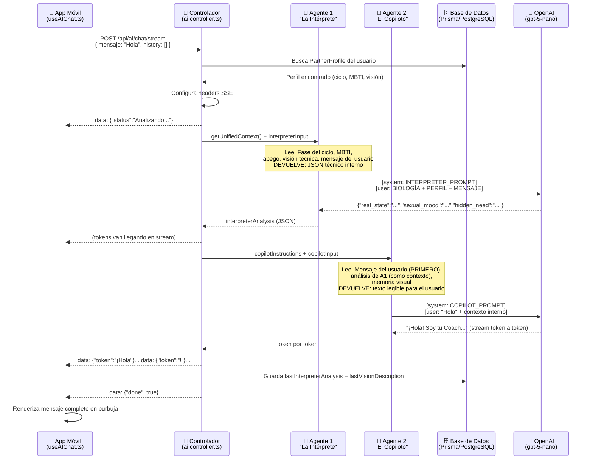
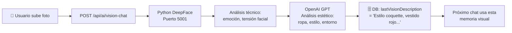

# MateCare AI — Arquitectura del Sistema de Doble Agente

## Flujo Completo: Desde el "Hola" hasta la Respuesta



---

## Roles de Cada Agente

| Agente | Nombre | Función | ¿Ve el mensaje del usuario? | Responde al usuario |
|--------|--------|---------|---------------------------|---------------------|
| **Agente 1** | La Intérprete | Psicóloga experta en mujeres. Analiza el estado emocional, hormonal y de apego de la pareja. | Sí (como contexto extra) | ❌ NO. Solo genera JSON interno. |
| **Agente 2** | El Copiloto | Coach masculino. Le habla directamente al usuario. Usa el análisis de A1 como "inteligencia secreta". | Sí (PRIMERO y con prioridad) | ✅ SÍ. Genera la respuesta visible. |

---

## Qué Lee Cada Agente

### Agente 1 — La Intérprete (`INTERPRETER_SYSTEM_PROMPT`)
```
BIOLOGÍA: Fase Luteal, Día 19
CONTEXTO BIOLÓGICO: [descripción de la fase]
PERFIL PSICOLÓGICO:
  - MBTI: ESTP (descripción)
  - APEGO: SECURE (descripción)
VISIÓN_LOCAL: {"style": "casual", "emotion": "neutral"}
MENSAJE/ORDEN: "Hola"           ← el mensaje va, pero es baja prioridad para A1
```

### Agente 2 — El Copiloto (`COPILOT_SYSTEM_PROMPT`)
```
MENSAJE DEL USUARIO: "Hola"     ← PRIMERO Y CON ÉNFASIS

CONTEXTO INTERNO (solo referencia):
- Estado emocional: [output de A1]
- Necesidad oculta: [output de A1]
- Nota táctica: [output de A1]
- Memoria visual: "Estilo casual, proyecta..."
```

---

## Flujo del Escáner de Visión (Separado del Chat)



**El Escáner NO forma parte del chat.** Solo escribe en `lastVisionDescription` del perfil. El chat la lee en cada consulta.

---

## Campos de DB Relevantes (PartnerProfile)

| Campo | Escrito por | Leído por | Descripción |
|-------|-------------|-----------|-------------|
| `lastVisionDescription` | Escáner de Visión | Chat (A2) | "Lleva vestido rojo, estilo coquette..." |
| `lastInterpreterAnalysis` | Chat (A1) | — | JSON técnico del último análisis |
| `visionAnalysis` | Escáner Python | Chat (A1) | Datos técnicos: emoción, tensión facial |
| `lastAdvice` | Dashboard/Oracle | Dashboard | Consejo del día |

---

## ⚠️ Problema Actual Diagnosticado

El Copiloto (A2) está ignorando el saludo porque:
1. El `COPILOT_SYSTEM_PROMPT` base + las instrucciones extra crean reglas **contradictorias**
2. El modelo prioriza el análisis táctico denso sobre el simple "Hola"

**Fix aplicado:** El `copilotInput` ahora pone `MENSAJE DEL USUARIO` **primero**, y el análisis interno es marcado como "solo de referencia". El log `[DEBUG] RESPUESTA COPILOTO: "..."` revelará exactamente qué dice la IA.
